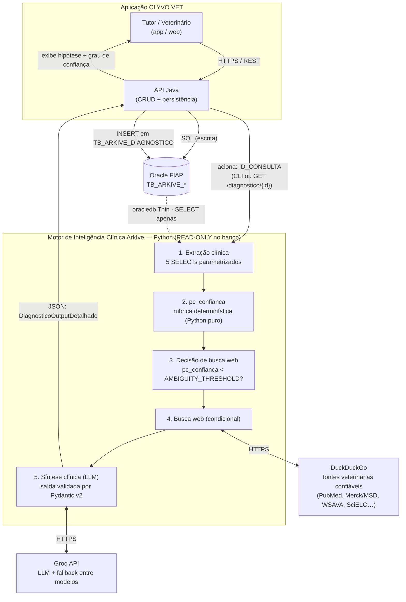

# ArkIve — Motor de Inteligência Clínica Veterinária

> **FIAP Challenge 2026 — 2º Ano ADS | Turmas de Fevereiro**
> Parceria: **Clyvo Vet** · Disciplina: *Disruptive Architectures: IoT, IoB & Generative AI*

---

## Equipe

| Nome | RM |
|------|----|
| Gustavo Crevelari | RM561408 |
| Lucca Gomes | RM561996 |
| Rafaela Ferreira | RM561671 |
| Victor Sabelli | RM566224 |

---

## Repositório
 
[](https://github.com/2TDSPO-1-2/arkive_clinical_engine)

---

## Demonstração em Vídeo

> Apresentação do projeto, explicação da arquitetura e testes (gravação das Sprints 1 e 2).

[](https://www.youtube.com/watch?v=zWqLgywXfv4)

---

## Problema Abordado

A jornada de saúde do pet é **fragmentada e reativa**. Responsáveis e veterinários interagem apenas em momentos pontuais — vacinas, emergências, retornos — sem continuidade inteligente entre as consultas.

Do ponto de vista clínico, isso significa que o veterinário frequentemente:

- Não tem acesso rápido ao histórico consolidado do animal no momento da consulta;
- Precisa cruzar manualmente sintomas, raça, espécie e predisposições genéticas;
- Toma decisões sem suporte de evidências clínicas atualizadas.

**Impacto direto:** agravamento evitável de quadros, baixa adesão a tratamentos e perda de recorrência para as clínicas.

---

## Solução Proposta

O **Motor de Inteligência Clínica Veterinária ArkIve** é um microsserviço Python que, a partir do ID de uma consulta veterinária, extrai automaticamente os dados clínicos do banco Oracle (histórico do animal, sintomas, bem-estar, predisposições genéticas da raça e diagnósticos anteriores), e aciona um modelo de linguagem (LLM) via API para gerar uma **hipótese diagnóstica estruturada** — pronta para ser consumida pelo serviço Java que persiste o resultado no banco.

O sistema opera em **modo estritamente read-only** no banco, nunca escrevendo ou alterando dados. Atende qualquer espécie animal — doméstica, silvestre, zoológica ou de produção. Disponível tanto via CLI (`main.py`) quanto via API REST (`api.py`).

### Como a solução melhora a jornada

| Para quem | Benefício |
|-----------|-----------|
| **Pet** | Hipótese diagnóstica mais fundamentada, considerando predisposição genética e histórico clínico |
| **Responsável** | Continuidade do cuidado — cada consulta alimenta a inteligência do sistema |
| **Veterinário** | Apoio à decisão clínica em segundos, com raciocínio explicado e grau de confiança |
| **Clínica** | Diferencial competitivo com IA integrada ao prontuário existente |

---

## Componente de Inteligência Artificial

O motor de IA é o núcleo do ArkIve. Abaixo: como ele raciocina, o que usa como base clínica e
como se conecta ao resto da plataforma.

Retomando o [problema abordado](#problema-abordado): sem inteligência ligando uma consulta à
seguinte, o veterinário decide sem o histórico consolidado à mão. A cada consulta registrada, o
motor consolida automaticamente o que se sabe daquele animal e devolve uma **hipótese diagnóstica
estruturada, explicada e com grau de confiança**, para o veterinário revisar e validar — e essa
validação já entra como contexto da próxima consulta. É isso que torna a jornada *contínua*.

### Um motor híbrido: regras + LLM

A abordagem é **híbrida — motor de regras determinístico + LLM (IA Generativa) com saída
estruturada validada**. Antes de fechar nessa combinação, avaliamos outras:

| Alternativa | Limitação para este caso |
|---|---|
| **Modelo preditivo supervisionado** | Não há base rotulada de diagnósticos confirmados em volume suficiente para treino; o catálogo de doenças e predisposições (`TB_ARKIVE_DOENCA`, `TB_ARKIVE_PREDISPOSICAO`) ainda está em povoamento. Um modelo treinado agora aprenderia ruído. |
| **Sistema de recomendação** | O produto não é um *ranking* de itens (serviços, produtos), e sim **raciocínio clínico explicado**. Recomendação não entrega o "porquê". |
| **NLP isolado** | A transcrição de voz (`DS_TRANSCRICAO`) já é consumida, mas o valor está em **correlacionar** o texto livre com dados estruturados, histórico e predisposição — não em extrair entidades do texto. |
| **Motor de regras puro** | Ótimo onde a regra é clara e precisa ser auditável e barata, mas rígido demais para redigir a síntese clínica em linguagem natural. |

Como cada parte é usada:

- **Motor de regras determinístico (Python puro, sem LLM):**
  - `_calculate_confidence()` — rubrica de pontos fixa sobre os dados reais do Oracle, produz
    `pc_confianca` (0–100). Auditável, reproduzível, custo zero.
  - `_decide_web_search()` — usa o **mesmo** `pc_confianca` para decidir se aciona a busca web
    (`pc_confianca < AMBIGUITY_THRESHOLD`). Fonte única de verdade, sem heurística paralela.
  - match de predisposição × sintomas por palavras-chave catalogadas (`TB_ARKIVE_DOENCA.DS_SINTOMAS`).
- **LLM (Groq API, `ChatGroq.with_structured_output`):** faz a **síntese clínica em português**,
  explicável, sobre contexto heterogêneo (perfil + sintomas + transcrição + bem-estar + histórico
  + medicações + status preventivo + literatura web opcional). Saída **validada por Pydantic v2**
  (`DiagnosticoOutputDetalhado`), `temperature=0.10`, com fallback automático entre modelos.
- **Busca web condicional (DuckDuckGo, `ddgs`):** enriquecimento tipo-RAG quando a confiança é
  baixa, restrito a uma lista curada de fontes veterinárias confiáveis (ver
  [Fluxo de Decisão — Busca Web](#fluxo-de-decisão--busca-web)).
- **Prompt engineering:** system prompt com travas anti-alucinação explícitas
  (`prompts/diagnostic.py`).

Em resumo: determinismo onde existe regra clara (confiança, gatilho de busca, match de
predisposição); IA Generativa onde é preciso julgamento e redação — sempre com validação de schema
e o `pc_confianca` calculado fora do modelo.

### Personalização por animal

A personalização é **por animal**, não por um perfil genérico de espécie/raça. A cada execução, o
motor monta o contexto daquele animal específico a partir de:

| Sinal de personalização | Origem | Como personaliza |
|---|---|---|
| Perfil do paciente | `TB_ARKIVE_ANIMAL` + `TB_ARKIVE_ESPECIE` + `TB_ARKIVE_RACA` | espécie, raça exata, porte, sexo, status reprodutivo |
| Narrativa da consulta atual | `TB_ARKIVE_CONSULTA` (`DS_MOTIVO`, `DS_SINTOMAS`, `DS_TRANSCRICAO`) | relato bruto do veterinário daquela consulta |
| Bem-estar longitudinal | `TB_ARKIVE_AVALIACAO_BEM_ESTAR` | apetite, atividade, comportamento, peso e idade ao longo do tempo |
| Predisposição genética | `TB_ARKIVE_PREDISPOSICAO` + `TB_ARKIVE_DOENCA` | herança nível espécie (sempre) + raça exata do animal |
| Histórico de diagnósticos | `TB_ARKIVE_DIAGNOSTICO` (outras consultas) | recorrência, progressão de severidade, diagnósticos não validados pelo vet |
| Medicações e adesão | `TB_ARKIVE_PRESCRICAO` + `TB_ARKIVE_ADESAO_PRESCRICAO` | tratamento em curso, falha de resposta, baixa adesão como risco |
| Cuidado preventivo | `TB_ARKIVE_PROTOCOLO_PREVENTIVO` + `TB_ARKIVE_EVENTO_PREVENTIVO` | vacina/vermífugo/check-up atrasado como fator de risco de fundo |

O `pc_confianca` também é personalizado: ele é calculado sobre os dados reais **daquele** animal e
decide, para aquele caso, se vale enriquecer o raciocínio com literatura externa.

### Dados clínicos que a IA utiliza

Todos os dados vêm do banco Oracle da FIAP, em **modo estritamente read-only** (apenas `SELECT`).

| Fonte (origem) | Estrutura (colunas-chave) | Utilização pela IA |
|---|---|---|
| `TB_ARKIVE_ANIMAL` | `NM_ANIMAL`, `DS_SEXO`, `DS_CASTRADO`, `ID_ESPECIE`, `ID_RACA` | perfil-base do paciente |
| `TB_ARKIVE_ESPECIE` / `TB_ARKIVE_RACA` | `NM_ESPECIE`; `NM_RACA`, `TP_PORTE` | correlação de sintomas com espécie/raça/porte |
| `TB_ARKIVE_CONSULTA` | `DT_HORA`, `TP_MODALIDADE`, `DS_MOTIVO`, `DS_SINTOMAS`, `DS_OBSERVACAO`, `DS_TRANSCRICAO`, `KG_PESO` | quadro clínico atual; `DS_TRANSCRICAO` = relato bruto (voz) do veterinário |
| `TB_ARKIVE_AVALIACAO_BEM_ESTAR` | `NR_IDADE`, `KG_PESO`, `DS_APETITE`, `DS_ATIVIDADE`, `DS_COMPORTAMENTO` | indicadores sistêmicos; avaliação mais recente do animal |
| `TB_ARKIVE_DOENCA` + `TB_ARKIVE_PREDISPOSICAO` | `NM_DOENCA`, `DS_DOENCA`, `DS_SINTOMAS`; `ID_ESPECIE`, `ID_RACA`, `ID_DOENCA` | predisposições genéticas da espécie (sempre) e da raça exata |
| `TB_ARKIVE_DIAGNOSTICO` (outras consultas) | `DS_DIAGNOSTICO`, `TP_SEVERIDADE`, `PC_CONFIANCA`, `ST_CONFIRMADO`, `ST_VALIDACAO_VET` | continuidade de cuidado: recorrência, progressão, ceticismo com o não validado |
| `TB_ARKIVE_PRESCRICAO` + `TB_ARKIVE_ADESAO_PRESCRICAO` | `NM_MEDICAMENTO`, `DS_DOSAGEM`, `DS_FREQUENCIA`, `TP_VIA_ADMINISTRACAO`, `DT_INICIO`/`DT_FIM`; `ST_TOMOU` | medicações vigentes, resposta ao tratamento, adesão terapêutica |
| `TB_ARKIVE_PROTOCOLO_PREVENTIVO` + `TB_ARKIVE_EVENTO_PREVENTIVO` | `NM_PROTOCOLO`, `TP_PROTOCOLO` (`VACINA`/`VERMIFUGO`/`CHECK-UP`/`ANTIPARASITARIO`), `ST_STATUS`, `DT_PROXIMO` | imunização/vermifugação em atraso como fator de risco e recomendação |

**Saída da IA** — `DiagnosticoOutputDetalhado` (Pydantic v2), consumida pela API Java e persistida
em `TB_ARKIVE_DIAGNOSTICO`: ver [Schema de Saída](#schema-de-saída-pydantic-v2).

### Arquitetura e fluxo de dados

1. **Tutor / veterinário** usam a aplicação (app/web) para registrar animal, consulta, bem-estar,
   prescrições e eventos preventivos.
2. A **API Java** faz o CRUD e persiste tudo no **Oracle** (`TB_ARKIVE_*`).
3. Ao concluir uma consulta, a API Java aciona o **Motor ArkIve** por `ID_CONSULTA` — via CLI
   (`python main.py <id>`) ou REST (`GET /diagnostico/{id_consulta}`).
4. O motor **lê o Oracle em modo read-only** (5 consultas: dados clínicos, predisposições,
   histórico de diagnósticos, prescrições, cuidado preventivo), calcula o `pc_confianca`,
   opcionalmente consulta o **DuckDuckGo**, e chama a **Groq API**.
5. O motor devolve um **JSON estruturado** (`DiagnosticoOutputDetalhado` + `ds_insight_ia`).
6. A **API Java grava** o resultado em `TB_ARKIVE_DIAGNOSTICO`.
7. A aplicação **exibe a hipótese** ao veterinário, que a valida (`ST_VALIDACAO_VET`) — e essa
   validação entra no histórico da próxima consulta.



A fronteira do motor com o banco é **somente leitura** em três camadas (privilégio `GRANT SELECT`,
`autocommit = False`, `rollback()` no `finally`) — ver [Garantias de Segurança](#garantias-de-segurança-read-only).

---

## Tecnologias Utilizadas

| Camada | Tecnologia | Papel no sistema |
|--------|-----------|-----------------|
| Linguagem | Python 3.11+ | Orquestra todas as etapas |
| LLM / IA Generativa | [Groq API](https://console.groq.com) · modelo configurável via `.env`, com fallback automático entre modelos | Gera o raciocínio clínico e o diagnóstico |
| Integração LLM | `langchain-groq` + `langchain-core` · `ChatGroq.with_structured_output()` | Conecta ao Groq e garante saída JSON validada pelo Pydantic; sem chains ou pipelines LCEL |
| Banco de Dados | Oracle via `oracledb` (modo Thin) | Fonte de dados clínicos — somente leitura |
| Validação de Schema | Pydantic v2 | Valida e tipifica a saída da IA |
| Busca Web (fallback) | `ddgs` (DuckDuckGo Search) | Literatura veterinária complementar — só resultados de uma lista curada de fontes confiáveis são aproveitados |
| API REST | FastAPI + Uvicorn | Endpoint HTTP alternativo ao CLI (`GET /diagnostico/{id_consulta}`) |
| Variáveis de Ambiente | `python-dotenv` | Isola credenciais do código-fonte |

---

## Arquitetura do Sistema

O diagrama arquitetural completo (aplicação, banco, APIs e componentes de IA) está na seção
[Arquitetura e fluxo de dados](#arquitetura-e-fluxo-de-dados).
Abaixo, o detalhamento do pipeline interno do motor:

```
Entrada: main.py ──► python main.py <ID_CONSULTA>   (ou api.py ──► GET /diagnostico/{id_consulta})
Etapa 1 ──► Oracle (READ-ONLY): 5 SELECTs parametrizados extraem animal, espécie, raça, consulta (incl.
             DS_TRANSCRICAO — relato bruto do veterinário), bem-estar, predisposições genéticas (nível espécie +
             raça exata), os últimos DIAGNOSTIC_HISTORY_LIMIT diagnósticos anteriores do animal, as últimas
             HISTORICO_CUIDADO_LIMIT prescrições (com adesão) e os eventos de cuidado preventivo
             (vacina/vermífugo/check-up, priorizando ATRASADO/PENDENTE).
Etapa 2 ──► Python puro (sem LLM): _calculate_confidence() calcula pc_confianca com rubrica fixa baseada na
             narrativa clínica (DS_TRANSCRICAO + DS_SINTOMAS combinados) e nos demais dados reais do Oracle
             (inclui match de predisposição via nome da doença e DS_SINTOMAS catalogado).
Etapa 3 ──► Python puro (sem LLM): _decide_web_search() aciona busca web se pc_confianca < AMBIGUITY_THRESHOLD —
             mesma métrica usada em toda a decisão, sem heurística paralela.
Etapa 4 ──► DuckDuckGo (condicional): busca literatura veterinária; um pós-filtro descarta todo resultado
             que não seja de uma lista curada de fontes confiáveis (PubMed/PMC, Merck & MSD Vet Manual,
             WSAVA, AVMA, periódicos peer-reviewed, SciELO, CFMV…).
Etapa 5 ──► Groq API (com fallback + retry entre modelos — ver seção dedicada): recebe resumo clínico
             (incl. medicações vigentes e status de cuidado preventivo) + pc_confianca pronto e gera
             DiagnosticoOutputDetalhado (4 campos de raciocínio clínico), validado pelo Pydantic v2.
Saída: JSON ──► {ds_diagnostico, tp_severidade, ds_insight_ia, pc_confianca, fontes_pesquisadas, + campos de
             insight individuais (insight_perfil, insight_correlacao, insight_predisposicao, insight_limitacoes)}

A resposta é consumida pela API Java para persistência em TB_ARKIVE_DIAGNOSTICO.
```

### Estrutura de Arquivos

```
arkive_clinical_engine/
├── .env                        # Variáveis de ambiente
├── requirements.txt            # Dependências com versões fixas
├── config.py                       # Configuração centralizada + validação fail-fast
├── main.py                         # Ponto de entrada CLI
├── api.py                          # Ponto de entrada API REST (FastAPI)
├── test_clinical_summary.py        # Check offline (assert puro) da renderização do resumo clínico
├── agents/
│   └── clinical_agent.py           # Motor principal (LangChain + Groq + heurística determinística)
├── database/
│   ├── connection.py               # Conexão Oracle Thin mode, READ-ONLY
│   └── queries.py                  # 5 SQLs parametrizados + dataclass ClinicalContext
├── prompts/
│   └── diagnostic.py               # System prompt do Groq (histórico de versões fica no Git)
└── schemas/
    └── diagnostic_detalhado.py     # Pydantic v2: DiagnosticoOutputDetalhado
```

---

## Como Executar (How To)

### Pré-requisitos

- Python 3.11 ou superior
- Acesso ao banco Oracle da FIAP (`oracle.fiap.com.br`)
- Conta gratuita no [Groq Console](https://console.groq.com) para obter a API Key

### 1. Clonar o repositório

```bash
git clone https://github.com/<seu-usuario>/arkive_clinical_engine.git
cd arkive_clinical_engine
```

### 2. Criar e ativar o ambiente virtual

```bash
# Windows
python -m venv venv
venv\Scripts\activate

# Mac / Linux
python -m venv venv
source venv/bin/activate
```

### 3. Instalar as dependências

```bash
pip install -r requirements.txt
```

> **Atenção — Windows:** se ocorrer erro de compilação C++ ao instalar `oracledb`, instale o [Microsoft C++ Build Tools](https://visualstudio.microsoft.com/visual-cpp-build-tools/) ou tente:
> ```bash
> pip install oracledb==2.3.0 --only-binary=:all:
> ```

### 4. Configurar as variáveis de ambiente

Edite o `.env`:

```env
# Banco Oracle FIAP
ORACLE_DSN=oracle.fiap.com.br:1521/ORCL
ORACLE_USER=seu_usuario_fiap
ORACLE_PASSWORD=sua_senha_fiap

# Groq (obtenha em https://console.groq.com → API Keys)
GROQ_API_KEY=gsk_sua_chave_aqui
GROQ_MODEL_PRIMARY=openai/gpt-oss-120b
GROQ_MODEL_FALLBACKS=qwen/qwen3.6-27b,openai/gpt-oss-20b
GROQ_MAX_RETRIES_PER_MODEL=2
GROQ_RETRY_BACKOFF_SECONDS=2

# Configurações opcionais
LOG_LEVEL=INFO
AMBIGUITY_THRESHOLD=60
DIAGNOSTIC_HISTORY_LIMIT=5
HISTORICO_CUIDADO_LIMIT=5
MAX_TRANSCRICAO_CHARS=6000
```

### 5. Executar

```bash
python main.py <ID_CONSULTA>
```

**Exemplo:**

```bash
python main.py 1
```

**Alternativa via API REST:**

```bash
uvicorn api:app --reload
# GET http://localhost:8000/diagnostico/1
```

### 6. Saída esperada

```json
{
  "ds_diagnostico": "Suspeita de Gastroenterite Infecciosa Canina",
  "tp_severidade": "MODERADA",
  "insight_perfil": "Paciente Rex, canino, macho...",
  "insight_correlacao": "Vômito frequente e fezes moles correlacionam-se com...",
  "insight_predisposicao": "Nenhuma predisposição mapeada localmente; limitação de dado...",
  "insight_limitacoes": "Recomenda-se exame de fezes e hemograma completo...",
  "ds_insight_ia": "Paciente Rex, canino, macho...\n\nVômito frequente...\n\nNenhuma predisposição...\n\nRecomenda-se...",
  "pc_confianca": 55,
  "fontes_pesquisadas": []
}
```

`ds_insight_ia` é a composição textual dos 4 campos de insight (perfil + correlação + predisposição + limitações), mantida para compatibilidade com a coluna única `DS_INSIGHT_IA` (CLOB) esperada pelo serviço Java.

Logs de execução são exibidos no terminal. Em caso de erro, o JSON de saída conterá o campo `"error"` com a causa.

---

## Fluxo de Decisão — Busca Web

A busca web é acionada com base no **mesmo `pc_confianca`** calculado deterministicamente (ver seção seguinte) — não existe uma métrica de "ambiguidade" separada. Se `pc_confianca < AMBIGUITY_THRESHOLD` (padrão: 60%), o DuckDuckGo é acionado para buscar literatura veterinária atualizada, enriquecendo o contexto antes da chamada à LLM.

Só é aproveitado o resultado que vier de uma **lista curada de fontes veterinárias confiáveis** — PubMed/PMC, Merck & MSD Vet Manual, WSAVA, AVMA, AAHA, periódicos peer-reviewed (Wiley, ScienceDirect, Vet Record, Frontiers, MDPI) e fontes brasileiras (SciELO, CFMV). Qualquer outro domínio é descartado; se nada confiável for encontrado, o motor segue sem contexto externo (`fontes_pesquisadas: []`). A lista fica em `TRUSTED_VET_DOMAINS` (`agents/clinical_agent.py`).

**Resultado: normalmente 1 chamada à API do Groq por execução.** Em caso de erro transitório ou cota esgotada, o sistema pode tentar novamente ou trocar de modelo automaticamente — ver "Modelos Groq — Fallback e Retry" abaixo.

> **Dica para testes:** defina `AMBIGUITY_THRESHOLD=101` no `.env` para forçar a busca web em todas as execuções, já que `pc_confianca` nunca ultrapassa 100.

---

## Cálculo de Confiança (pc_confianca)

O grau de confiança é calculado **deterministicamente em Python** com base nos dados reais do Oracle, antes de chamar a LLM. O modelo recebe o valor pronto e apenas o utiliza — nunca recalcula. Esse mesmo valor decide se a busca web é acionada (ver seção anterior).

A rubrica de "sintomas" avalia a **narrativa clínica** — `DS_TRANSCRICAO` (relato bruto do veterinário) concatenado a `DS_SINTOMAS` (campo estruturado), quando ambos existirem — nunca só o campo estruturado isoladamente. `DS_TRANSCRICAO` nunca é copiado para `DS_SINTOMAS`/`DS_OBSERVACAO`: a combinação existe apenas como variável de execução usada pela rubrica, pela decisão de busca web e pela query de busca.

| Critério | Pontuação |
|----------|-----------|
| BASE (sempre) | +30 pts |
| Narrativa clínica específica e detalhada (> 3 características) | +25 pts |
| Narrativa clínica moderadamente descritiva (1–3 características) | +10 pts |
| Predisposição genética diretamente relacionada aos sintomas (nome da doença ou palavras-chave `DS_SINTOMAS`) | +20 pts |
| Predisposição genética presente mas indiretamente relacionada | +10 pts |
| Avaliação de bem-estar completa e coerente | +10 pts |
| Peso registrado e compatível | +5 pts |
| Dados clínicos relevantes ausentes (peso, idade ou bem-estar) | -10 pts |
| Narrativa clínica vaga ou genérica demais | -15 pts |

> **Predisposição racial ≠ evidência principal.** O system prompt (`prompts/diagnostic.py`) só permite tratar uma predisposição genética mapeada como diferencial prioritário quando há sinal clínico compatível na narrativa (transcrição e/ou sintomas). Sem sinal clínico compatível, a predisposição entra apenas como fator de risco de fundo em `insight_predisposicao` — nunca como base de `ds_diagnostico`.

> **Medicações e cuidado preventivo não entram na rubrica.** As seções de prescrições e de status preventivo são injetadas no resumo clínico e alimentam o **raciocínio da LLM** (`insight_correlacao`, `insight_limitacoes`), mas **não** alteram o `pc_confianca` — a rubrica mede qualidade de sintoma, predisposição e bem-estar, e é mantida estável para permanecer auditável.

---

## Modelos Groq — Fallback e Retry

O motor tenta os modelos na ordem `GROQ_MODEL_PRIMARY` → `GROQ_MODEL_FALLBACKS`. Erros de cota/indisponibilidade (HTTP 429, modelo descontinuado) pulam direto para o próximo modelo; erros transitórios (timeout, conexão, 5xx) são retentados no mesmo modelo antes de trocar.

| Variável | Padrão | Papel |
|---|---|---|
| `GROQ_MODEL_PRIMARY` | `openai/gpt-oss-120b` | Modelo tentado primeiro |
| `GROQ_MODEL_FALLBACKS` | `qwen/qwen3.6-27b,openai/gpt-oss-20b` | Modelos seguintes, em ordem |
| `GROQ_MAX_RETRIES_PER_MODEL` | `2` | Tentativas no mesmo modelo para erro transitório |
| `GROQ_RETRY_BACKOFF_SECONDS` | `2` | Backoff exponencial entre tentativas (2s, 4s, ...) |

Cada execução recomeça pelo modelo primário — não há memória de qual modelo foi usado na execução anterior.

---

## Schema de Saída (Pydantic v2)

`DiagnosticoOutputDetalhado`, mapeado para gravação futura na tabela `TB_ARKIVE_DIAGNOSTICO` pelo serviço Java:

| Campo | Tipo | Descrição |
|-------|------|-----------|
| `ds_diagnostico` | `str` (5–500 chars) | Título conciso da hipótese diagnóstica |
| `tp_severidade` | `Literal["LEVE", "MODERADA", "GRAVE"]` | Classificação de severidade |
| `insight_perfil` | `str` (mín. 20 chars) | Perfil do paciente e apresentação clínica |
| `insight_correlacao` | `str` (mín. 20 chars) | Correlação entre sintomas, bem-estar, histórico e hipótese |
| `insight_predisposicao` | `str` (mín. 20 chars) | Papel das predisposições genéticas no raciocínio |
| `insight_limitacoes` | `str` (mín. 20 chars) | Limitações do diagnóstico e exames complementares sugeridos |
| `pc_confianca` | `int` (0–100) | Grau de certeza calculado deterministicamente em Python |
| `fontes_pesquisadas` | `list[str]` | URLs consultadas (lista vazia se busca web não foi acionada) |

O payload final também inclui `ds_insight_ia`, composto a partir dos 4 campos de insight acima, para compatibilidade com a coluna única `DS_INSIGHT_IA` (CLOB) do banco.

---

## Garantias de Segurança (READ-ONLY)

O microsserviço garante a imutabilidade do banco em três camadas:

1. **Privilégios DB:** o usuário Oracle deve ter apenas `GRANT SELECT` nas tabelas ArkIve (enforçado pelo DBA);
2. **`autocommit = False`:** configurado explicitamente na conexão;
3. **`rollback()` no finally:** desfaz qualquer transação pendente acidental antes de fechar a conexão.

Nenhum `INSERT`, `UPDATE`, `DELETE` ou `MERGE` existe em qualquer arquivo do projeto.

---

## Solução de Problemas Comuns

| Erro | Causa | Solução |
|------|-------|---------|
| `ORA-12505` | SID não reconhecido | Usar o DSN no formato longo: `(DESCRIPTION=(ADDRESS=...)(CONNECT_DATA=(SID=ORCL)))` |
| `ORA-01017` | Usuário/senha incorretos | Verificar `ORACLE_USER` e `ORACLE_PASSWORD` no `.env` |
| `429 quota exceeded` | Cota diária de um modelo atingida | O sistema troca automaticamente para o próximo modelo em `GROQ_MODEL_FALLBACKS`; se todos falharem, aguardar reset ou criar nova API key |
| `Erro de configuração` ao subir `api.py`/`main.py` | Variável obrigatória ausente ou malformada no `.env` | Ler a mensagem impressa (lista exatamente o que falhou) e corrigir o `.env` |
| `ModuleNotFoundError` | Dependência não instalada | Rodar `pip install -r requirements.txt` com o venv ativo |
| `Nenhuma consulta encontrada` | ID inexistente no banco | Verificar se o ID existe em `TB_ARKIVE_CONSULTA` |
| `Ratelimit` no DuckDuckGo | Muitas buscas em sequência | O sistema continua sem contexto web; aguarde alguns segundos entre execuções |

---

## Dependências

```
oracledb>=2.3.0,<3.0.0
langchain-core>=0.3.0,<0.4.0
langchain-groq>=0.2.0,<1.0.0
ddgs>=0.1.0
pydantic>=2.7.0,<3.0.0
python-dotenv>=1.0.0,<2.0.0
fastapi>=0.110.0
uvicorn>=0.27.0
```

---

## Licença

Projeto acadêmico desenvolvido para o Challenge FIAP 2026 em parceria com a Clyvo Vet.
Uso restrito ao contexto educacional.